# 🏗️ Arquitectura y Diagramas del Sistema RTECH

## Índice
1. [Arquitectura General](#arquitectura-general)
2. [Diagrama de Componentes](#diagrama-de-componentes)
3. [Flujos de Usuario](#flujos-de-usuario)
4. [Diagramas de Secuencia](#diagramas-de-secuencia)
5. [Estructura de Datos](#estructura-de-datos)

---

## Arquitectura General

### Vista de Alto Nivel


### Capas de la Aplicación


---

## Diagrama de Componentes

### Estructura de Componentes React


### Contextos y Estado Global


---

## Flujos de Usuario

### Flujo de Navegación Principal


### Flujo de Administrador

```mermaid
graph TD
    A[Login como Admin] --> B[Dashboard]
    
    B --> C[Gestión de Productos]
    B --> D[Gestión de Órdenes]
    B --> E[Gestión de Usuarios]
    B --> F[Configuraciones]
    
    C --> C1[Importar Excel]
    C --> C2[Editar producto]
    C --> C3[Ver stock]
    
    D --> D1[Ver órdenes pendientes]
    D1 --> D2[Generar envío]
    D2 --> D3[Descargar etiqueta]
    D3 --> D4[Marcar como enviado]
    
    E --> E1[Ver usuarios]
    E --> E2[Bloquear/Desbloquear]
    E --> E3[Ajustar puntos]
    
    F --> F1[Actualizar cotización USD]
    F --> F2[Configurar markup]
    F --> F3[Configurar MercadoPago]
```



---

## Diagramas de Secuencia

### Proceso de Compra Completo

```mermaid
sequenceDiagram
    actor U as Usuario
    participant F as Frontend
    participant A as Server Actions
    participant DB as Database
    participant MP as MercadoPago
    participant E as Email Service
    
    U->>F: Agrega productos al carrito
    F->>F: Guarda en localStorage
    
    U->>F: Click en "Finalizar compra"
    F->>F: Verifica autenticación
    
    alt No autenticado
        F->>U: Redirect a /login
        U->>A: Login con credenciales
        A->>DB: Verificar usuario
        DB-->>A: Usuario válido
        A-->>F: Session creada
    end
    
    F->>U: Muestra formulario de checkout
    U->>F: Completa datos de envío
    
    F->>A: Calcula costo de envío
    A->>DB: Obtiene configuración
    DB-->>A: Configuración de envío
    A-->>F: Costo calculado
    
    U->>F: Confirma compra
    
    F->>A: createOrder()
    A->>DB: Verifica stock
    DB-->>A: Stock disponible
    
    A->>DB: Crea orden (PENDING)
    A->>DB: Reduce stock
    A->>DB: Registra uso de puntos
    DB-->>A: Orden creada
    
    A->>MP: Crea preferencia de pago
    MP-->>A: URL de pago
    A-->>F: Preferencia creada
    
    F->>U: Redirect a MercadoPago
    U->>MP: Realiza pago
    
    MP->>A: Webhook (payment.updated)
    A->>MP: Consulta estado del pago
    MP-->>A: Pago aprobado
    
    A->>DB: Actualiza orden a PAID
    A->>DB: Suma puntos al usuario
    DB-->>A: Actualizado
    
    A->>E: Envía email de confirmación
    
    MP->>U: Redirect a /checkout/success
    U->>F: Ve confirmación de compra
```



### Generación de Envío


### Actualización Automática de Precios

```mermaid
sequenceDiagram
    participant C as Cron Job
    participant SA as Server Action
    participant API as DolarAPI
    participant DB as Database
    participant Cache as Next.js Cache
    
    Note over C: Cada hora
    C->>SA: getExchangeRate()
    
    SA->>DB: Lee última cotización
    DB-->>SA: Rate actual
    
    SA->>API: Consulta cotización blue
    API-->>SA: Nuevo rate
    
    alt Rate cambió
        SA->>DB: Actualiza Setting EXCHANGE_RATE
        DB-->>SA: Actualizado
        
        SA->>DB: Recalcula pvpArs de productos
        DB-->>SA: Productos actualizados
        
        SA->>Cache: revalidatePath('/products')
        SA->>Cache: revalidatePath('/')
        
        Note over Cache: Cache invalidado
    else Rate igual
        Note over SA: No hace nada
    end
```



---

## Estructura de Datos

### Modelo de Datos Completo

```mermaid
erDiagram
    User ||--o{ Order : "places"
    User ||--o{ PointHistory : "has"
    User {
        string id PK
        string email UK
        string password
        string name
        enum role
        boolean isBlocked
        boolean canPurchase
        int points
        datetime createdAt
        datetime updatedAt
    }
    
    Order ||--|{ OrderItem : "contains"
    Order ||--o| Shipment : "has"
    Order {
        string id PK
        string userId FK
        enum status
        decimal total
        decimal shippingCost
        string shippingAddress
        string shippingZip
        string shippingMethod
        string paymentId
        string paymentStatus
        datetime createdAt
        datetime updatedAt
    }
    
    OrderItem }o--|| Product : "references"
    OrderItem {
        string id PK
        string orderId FK
        string productId FK
        int quantity
        decimal price
    }
    
    Product }o--o| Category : "belongs_to"
    Product {
        string id PK
        string sku UK
        string codigoAlfa
        string codigoProducto UK
        string name
        string description
        string categoria
        string subCategoria
        string marca
        decimal precio
        decimal impuestoInterno
        decimal iva
        string moneda
        decimal markup
        decimal cotizacion
        decimal pvpUsd
        decimal pvpArs
        decimal peso
        string ean
        string nivelStock
        int stockTotal
        int stockDepositoCliente
        int stockDepositoCd
        string garantia
        string link
        string imagen
        string miniatura
        string atributos
        boolean gamer
        decimal price
        int stock
        string imageUrl
        decimal weight
        string dimensions
        string categoryId FK
        string provider
        datetime createdAt
        datetime updatedAt
    }
    
    Category ||--o{ Category : "parent_child"
    Category ||--o{ Product : "has"
    Category {
        string id PK
        string name UK
        string slug UK
        string imageUrl
        string parentId FK
        datetime createdAt
        datetime updatedAt
    }
    
    Shipment {
        string id PK
        string orderId FK UK
        string trackingNumber UK
        string carrier
        string service
        decimal cost
        enum status
        string labelUrl
        datetime estimatedDelivery
        string metadata
        datetime createdAt
        datetime updatedAt
    }
    
    PointHistory {
        string id PK
        string userId FK
        int amount
        enum type
        string description
        datetime createdAt
    }
    
    Setting {
        string id PK
        string key UK
        string value
        string description
        datetime updatedAt
    }
```

### Estados de Orden

```mermaid
stateDiagram-v2
    [*] --> PENDING: Orden creada
    PENDING --> PAID: Pago confirmado
    PENDING --> CANCELLED: Pago fallido/timeout
    
    PAID --> SHIPPED: Envío generado
    PAID --> CANCELLED: Cancelación manual
    
    SHIPPED --> DELIVERED: Entrega confirmada
    SHIPPED --> CANCELLED: Problema en envío
    
    DELIVERED --> [*]
    CANCELLED --> [*]
    
    note right of PENDING
        Usuario completa checkout
        Orden en espera de pago
    end note
    
    note right of PAID
        Pago aprobado por MercadoPago
        Puntos sumados al usuario
    end note
    
    note right of SHIPPED
        Tracking number generado
        Etiqueta descargada
    end note
    
    note right of DELIVERED
        Envío completado
        Orden finalizada
    end note
```



### Estados de Envío

```mermaid
stateDiagram-v2
    [*] --> PENDING: Orden pagada
    PENDING --> LABEL_GENERATED: Etiqueta creada
    
    LABEL_GENERATED --> IN_TRANSIT: Despachado
    
    IN_TRANSIT --> OUT_FOR_DELIVERY: En reparto
    
    OUT_FOR_DELIVERY --> DELIVERED: Entregado
    OUT_FOR_DELIVERY --> FAILED: Intento fallido
    
    FAILED --> OUT_FOR_DELIVERY: Reintento
    FAILED --> CANCELLED: Cancelado
    
    PENDING --> CANCELLED: Cancelación
    LABEL_GENERATED --> CANCELLED: Cancelación
    IN_TRANSIT --> CANCELLED: Cancelación
    
    DELIVERED --> [*]
    CANCELLED --> [*]
```



### Flujo de Datos en Importación de Productos

```mermaid
graph LR
    A[Excel File] --> B[XLSX Parser]
    B --> C[Raw Data]
    
    C --> D{Proveedor?}
    D -->|ELIT| E[Mapeo ELIT]
    D -->|MOBE| F[Mapeo MOBE]
    
    E --> G[Datos Normalizados]
    F --> G
    
    G --> H[Obtener Exchange Rate]
    G --> I[Obtener Markup]
    
    H --> J[Calcular Precios]
    I --> J
    
    J --> K{Producto existe?}
    K -->|Sí| L[UPDATE]
    K -->|No| M[CREATE]
    
    L --> N[Database]
    M --> N
    
    N --> O[Revalidar Cache]
    O --> P[Productos Actualizados]
```



---

## Integraciones Externas

### Flujo de Integración con MercadoPago


### Flujo de Integración con Correo Argentino


---

## Seguridad y Autenticación

### Flujo de Autenticación


### Protección de Rutas

```mermaid
graph TD
    A[Request] --> B{Middleware}
    
    B --> C{Ruta pública?}
    C -->|Sí| D[Permitir acceso]
    C -->|No| E{Usuario autenticado?}
    
    E -->|No| F[Redirect a /login]
    E -->|Sí| G{Requiere admin?}
    
    G -->|No| D
    G -->|Sí| H{Es admin?}
    
    H -->|Sí| D
    H -->|No| I[Redirect a /]
    
    D --> J[Renderizar página]
    F --> K[Mostrar login]
    I --> L[Mostrar homepage]
```



---

## Performance y Optimización

### Estrategia de Caché


### Rendering Strategy


---

## Monitoreo y Logging

### Sistema de Logs


---

## Deployment Pipeline

```mermaid
graph LR
    A[Local Development] -->|git push| B[GitHub]
    B -->|webhook| C[Vercel]
    
    C --> D{Build}
    D -->|Success| E[Preview Deploy]
    D -->|Fail| F[Notify Developer]
    
    E --> G{Tests Pass?}
    G -->|Yes| H[Production Deploy]
    G -->|No| F
    
    H --> I[Database Migration]
    I --> J[Revalidate Cache]
    J --> K[Live Site]
    
    F --> A
```

---

## Conclusión

Este documento proporciona una visión visual completa de la arquitectura del sistema RTECH E-Commerce, incluyendo:

- **Arquitectura de componentes**: Cómo se organizan y comunican los diferentes módulos
- **Flujos de negocio**: Procesos clave del sistema desde la perspectiva del usuario
- **Diagramas de secuencia**: Interacciones detalladas entre componentes
- **Modelo de datos**: Estructura y relaciones de la base de datos
- **Integraciones**: Cómo se conecta con servicios externos
- **Seguridad**: Mecanismos de autenticación y autorización
- **Performance**: Estrategias de caché y optimización
- **Deployment**: Pipeline de despliegue

Para información detallada sobre implementación, consultar el **MANUAL_COMPLETO.md**.
